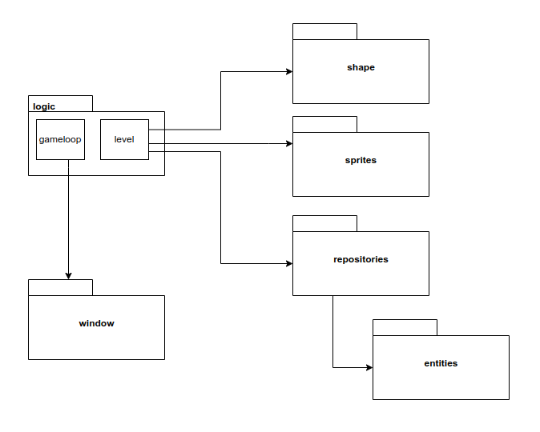
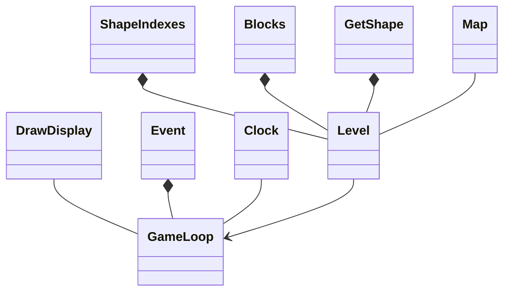
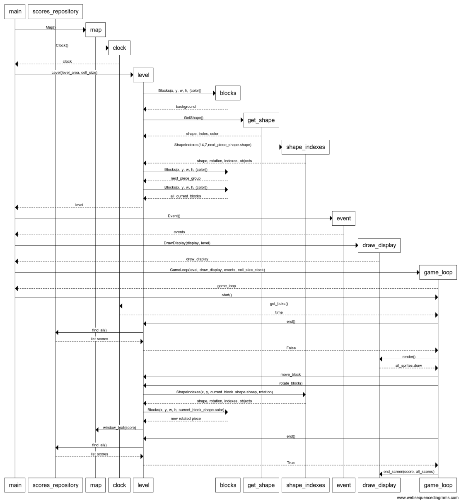

# Arkkitehtuurikuvaus

## Rakenne

Sovelluksella on kolmitasoinen kerrosarkkitehtuuri. Sovelluksen pakkauskaavio:

Pakkaus window sisältää käyttöliittymän koodia, logic sovelluslogiikan koodia, shape palikoiden muodostamisen koodia, sprites Sprite -olioiden muodostamisen koodia, repositories tietokannan muodostavaa koodia ja entities tietokannan käyttämän olion koodia.

## Käyttöliittymä

Käyttöliittymä sisältää kaksi näkymää: peliruudun ja loppuruudun. 
Näkymät näkyvät eri aikoina ruudulla. Näkymien tuomisesta ruudulle vastaa DrawDisplay luokka sekä Map luokka. Kun peli aloitetaan ja sen edetessä, piirtää DrawDisplay luokan metodi render spritet sekä ruudun. Pelin loppuessa luo DrawDisplay luokan metodi end_screen pelin loppuruudun näytölle. 

## Sovelluslogiikka

Sovelluksen toiminnasta vastaa luokka Level. Level tarjoaa käyttöliittymän toiminnoille metodit kuten:

- initialize_background
- initialize_shape
- move_block
- rotate_block
- clear_row

Level luokka pääsee käsiksi palikoiden luomiseen käytettäviin GetShape, ShapeIndexes ja Shapes luokkiin. Level luokassa myös luodaan Sprite -oliot kutsumalla luokkaa Blocks. 

## Sovelluksen tietokanta

Pakkauksen repositories luokka ScoreRepository tallentaa pelin pisteet SQLite-tietokantaan.

## Sekvenssikaavio

