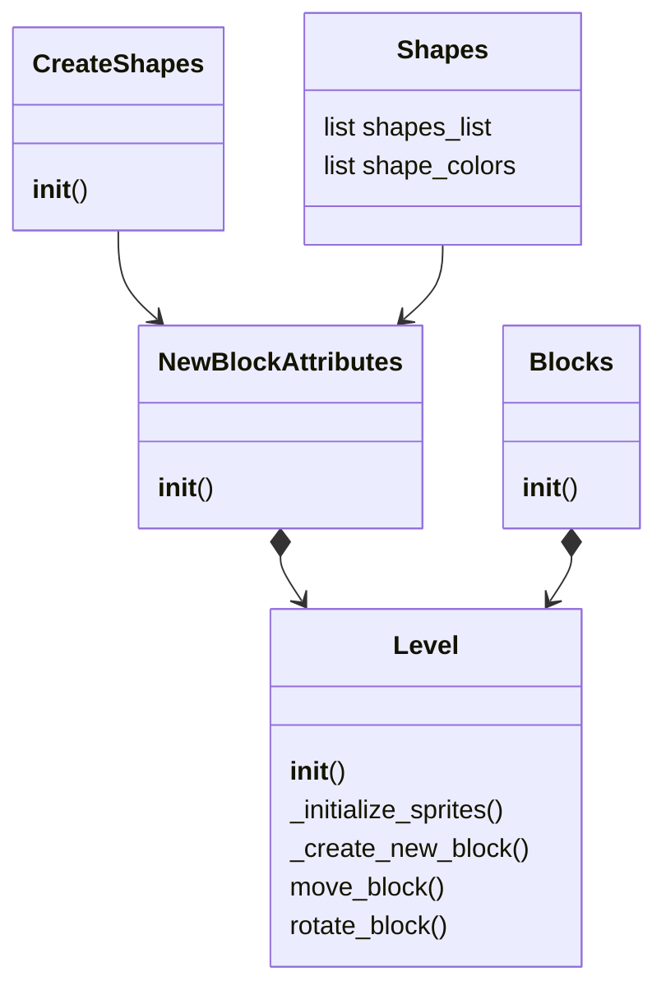

```mermaid
classDiagram
	GameLoop
	CreateShapes --> NewBlockAttributes
	NewBlockAttributes *--> Level 
	Blocks * --> Level
	Shapes --> NewBlockAttributes

	class Level {
		__init__()
		_initialize_sprites()
		_create_new_block()
		move_block()
		rotate_block()
	}

	class Blocks{
		__init__()
	}

	class NewBlockAttributes {
		__init__()
	}

	class Shapes {
		list shapes_list
		list shape_colors
	}

	class CreateShapes {
		__init__()
	}

```
