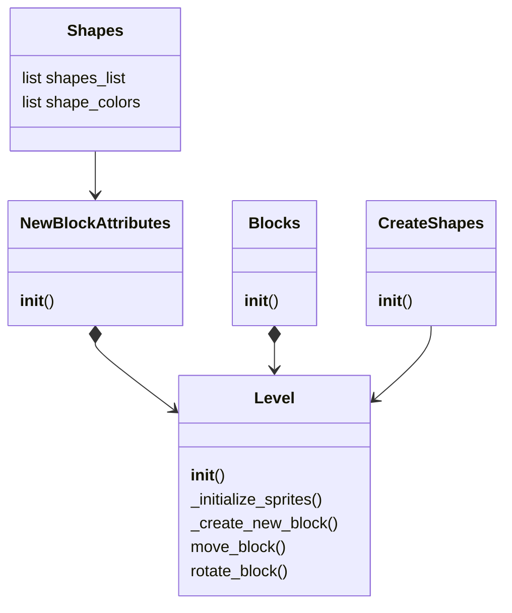
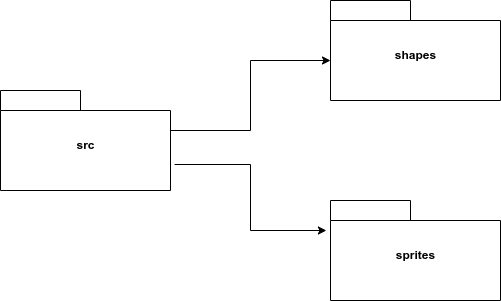
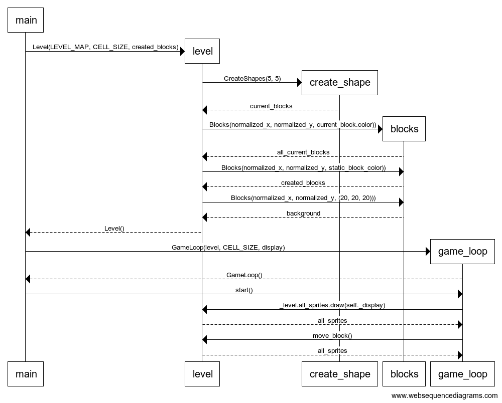

## Sovelluslogiikka

Sovelluksen toiminnasta vastaa luokka Level. Level tarjoaa käyttöliittymän toiminnoille metodit kuten:

- initialize_sprites
- initialize_shape
- move_block
- rotate_block

Level luokka pääsee käsiksi palikoiden luomiseen käytettäviin GetShape, ShapeIndexes ja Shapes luokkiin.

## Sekvenssikaavio

