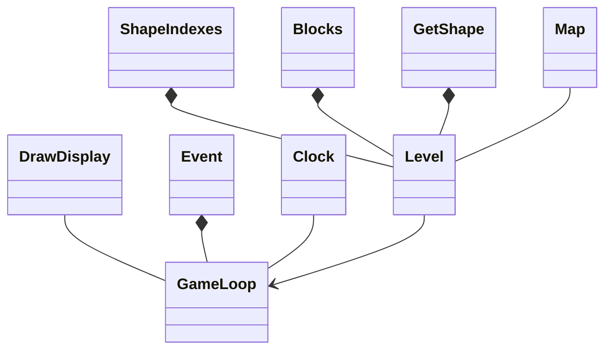
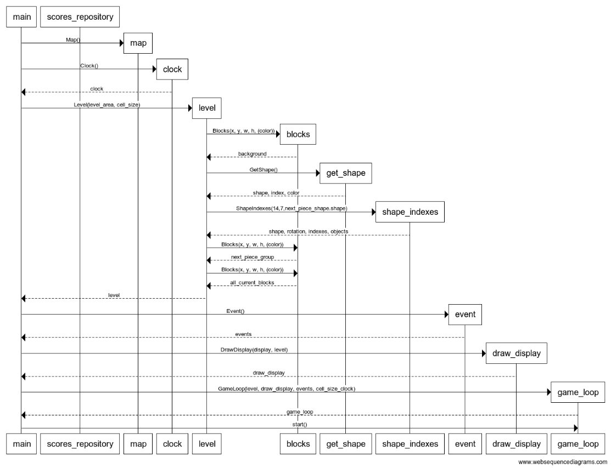
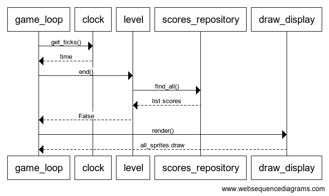
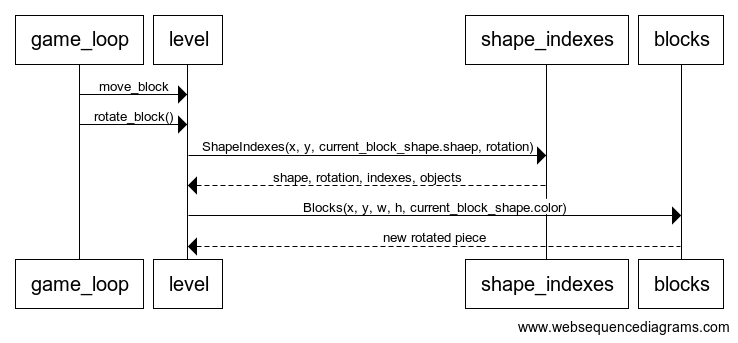
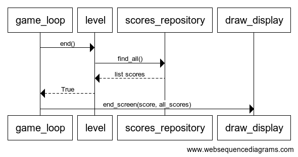

# Arkkitehtuurikuvaus

## Rakenne

Sovelluksella on kolmitasoinen kerrosarkkitehtuuri. Sovelluksen pakkauskaavio:

Pakkaus window sisältää käyttöliittymän koodia, logic sovelluslogiikan koodia, shape palikoiden muodostamisen koodia, sprites Sprite -olioiden muodostamisen koodia, repositories tietokannan muodostavaa koodia ja entities tietokannan käyttämän olion koodia.

## Käyttöliittymä

Käyttöliittymä sisältää kaksi näkymää: peliruudun ja loppuruudun. 
Näkymät näkyvät eri aikoina ruudulla. Näkymien tuomisesta ruudulle vastaa DrawDisplay luokka sekä Map luokka. Kun peli aloitetaan ja sen edetessä, piirtää DrawDisplay luokan metodi render spritet sekä ruudun. Pelin loppuessa luo DrawDisplay luokan metodi end_screen pelin loppuruudun näytölle. 

## Sovelluslogiikka

Sovelluksen toiminnasta vastaa luokka Level. Level tarjoaa käyttöliittymän toiminnoille metodit kuten:

- initialize_background
- initialize_shape
- move_block
- rotate_block
- clear_row

Level luokka pääsee käsiksi palikoiden luomiseen käytettäviin GetShape, ShapeIndexes ja Shapes luokkiin. Level luokassa myös luodaan Sprite -oliot kutsumalla luokkaa Blocks. 

## Sovelluksen tietokanta

Pakkauksen repositories luokka ScoreRepository tallentaa pelin pisteet SQLite-tietokantaan. Tietokantaluokka on ScoreRepository.

## Päätoiminnallisuudet

## Pelin aloitus

Kun pelin aloittaa, main metodi pohjustaa pelin luomalla Map, Clock, Level, Event, DrawDisplay ja GameLoop oliot. main metodi aloittaa pelin kutsumalla game_loop olion start metodia.

## Spritejen piirtäminen ruudulle

GameLoop-luokan start metodi hakee Clock luokasta pelin aloituksesta kuluneen ajan. start metodi hakee Level-luokan end metodilta tiedon, onko aika lopettaa peli, sekä nykyisen ja repositoriossa olevat pistemäärät. Kun ei ole aika lopettaa peliä kutsutaan DrawDisplay-luokan render metodia, joka piirtää spritet ruudulle.

## Palikan liikkuminen

GameLoop-luokasta kutsutaan Level-luokan move_block metodia, joka tarkastaa onko ok liikkuttaa palikkaan toivottuun suuntaan ja liikuttaa sen sinne, jos on. GameLoop-luokasta kutusutaan Level-luokna rotate_block metodia. rotate_block metodista kutsutaan Shape_Indexes ja Block -luokkia, jotka tuovat palikan uuden rotaation eri x- ja y-koordinaatit ja luovat näiden perusteella uuden palinkan vanhan tilalle. rotate_block metodissa tarkastetaan myös voiko rotaatio tapahtua (ei rotatoi yli reunan etc.) ja jos ei voi, rotaatiota ei tapahdu. 

## Rivin tyhjennys

Level-luokassa metodissa clear_row tarkastetaan, onko aika tyhjentää rivi. Jos on tyhjennetän rivi ja kutsutaan Map-luokkan windows_text metodia, joka päivittää ruudulla näkyvän pistemäärän nyt 10 pistettä suuremmaksi. 

## Pelin lopetus

Peli loppuu kun GameLoop-luokasta kutsuttaessa Level-luokan end metodia, metodi palauttaa pistemäärälistan lisäksi arvon True. Tällöin GameLoop-luokasta kutsutaan DrawDisplay-luokan end_screen metodia, joka piirtää ruudulle lopetusruudun.  

