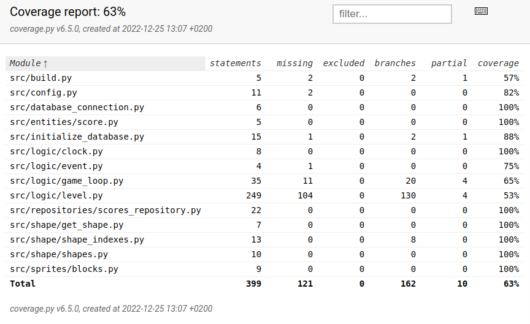

# Testausdokumentti

## Yksikkö ja integraatiotestaus

### Testikattavuus

Sovelluksen tastauskattavuus on 63%. 

Testaamatta jäi osa tiedoistoista build.py, config.py, initialized_database.py, event.py, game_loop.py ja level.py tiedostoista. Testikattavuuden ulkopuolelle olisi mahdollisesti voinut jättää tiedostot, build.py, initialze_database.py ja event.py. Suurin ja tärkein osuus joku jäi testikattavuuden ulkopuolelle oli level.py tiedoston rotate_block metodi, joka tarkasti palikan rotaatiota.

## Järjestelmätestaus

Sovelluksen järjestelmätestaus on tehty manuaalisesti. Sovellusta on testattu käyttöohjeen kuvaamalla tavalla. 

Toiminnallisuuksia on testattu manuaalisesti käymällä läpi mahdollisia nuolinäppäinsyötteitä. On myös testattu käyttää virheellisiä syötteitä, eli muita näppäimiä kuin nuolinäppäimiä. 

## Sovellukseen jääneet laatuongelmat

- Kaikkien eri palikkavaihtoehtojen rotaatio ei toimi täysin oikein.
