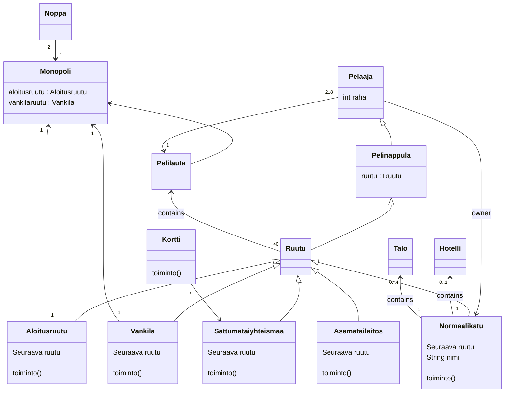

```mermaid
classDiagram
	Pelaaja "2..8" --> "1" Pelilauta
	Noppa "2" --> "1" Monopoli
	Pelilauta <-- "40" Ruutu : contains
	Monopoli <-- Pelilauta
	Kortti "*" -->  Sattuma tai yhteismaa
	Talo "0...4" <-- "1" Normaali katu : contains
	Hotelli "0..1" <-- "1" Normaali katu : contains
	Normaali katu <-- Pelaaja : owner
	Monopoli "1" <-- "1" Aloitusruutu
	Monopoli "1" <-- "1" Vankila
	Ruutu <|-- Aloitusruutu
        Ruutu <|-- Vankila
        Ruutu <|-- Sattuma tai yhteismaa
        Ruutu <|-- Asema tai laitos
        Ruutu <|-- Normaali katu
	Pelaaja <|-- Pelinappula
	Pelinappula <|-- Ruutu


	class Monopoli { 
		aloitusruutu : Aloitusruutu
		vankilaruutu : Vankila
	}
	class Noppa{
	}

	class Pelinappula{
		ruutu :  Ruutu
	}

	class Pelaaja{
		int raha
	}
	class Pelilauta{
	}

	class Ruutu{
	}

        class Aloitusruutu{
		Seuraava ruutu
                toiminto()
        }
        class Vankila{
                Seuraava ruutu
                toiminto()
        }
        class Sattuma tai yhteismaa{
                Seuraava ruutu
                toiminto()
        }
        class Asema tai laitos{
                Seuraava ruutu
                toiminto()
        }
        class Normaali katu{
                Seuraava ruutu
		String nimi
                toiminto()
        }

	class Talo {
	}

	class Hotelli { 
	}

	class Kortti{
		toiminto()
	}


```
