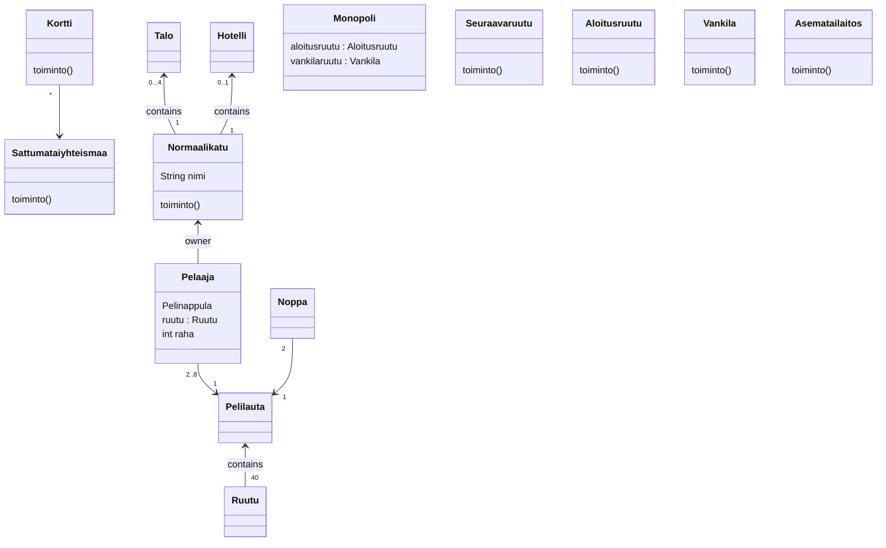

```mermaid
classDiagram
	Pelaaja "2..8" --> "1" Pelilauta
	Noppa "2" --> "1" Pelilauta
	Pelilauta <-- "40" Ruutu : contains
	Kortti "*" -->  Sattuma tai yhteismaa
	Talo "0...4" <-- "1" Normaali katu : contains
	Hotelli "0..1" <-- "1" Normaali katu : contains
	Normaali katu <-- Pelaaja : owner

	class Monopoli { 
		aloitusruutu : Aloitusruutu
		vankilaruutu : Vankila
	}
	class Noppa{
	}
	class Pelaaja{
		Pelinappula
			ruutu : Ruutu
		int raha
	}
	class Pelilauta{
	}
	class Seuraavaruutu{
		toiminto()
	}	
        class Aloitusruutu{
                toiminto()
        }
        class Vankila{
                toiminto()
        }
        class Sattuma tai yhteismaa{
                toiminto()
        }
        class Asema tai laitos{
                toiminto()
        }
        class Normaali katu{
		String nimi
                toiminto()
        }

	class Talo {
	}

	class Hotelli { 
	}

	class Kortti{
		toiminto()
	}


```
